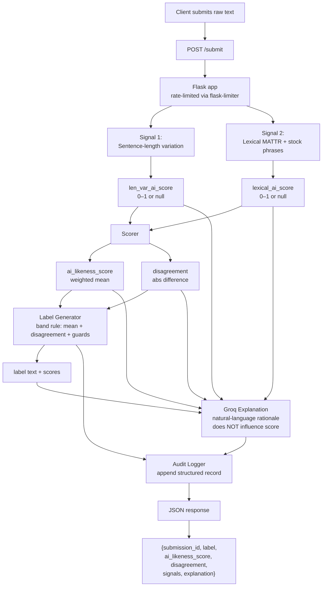

# Provenance Guard — Planning Document

This document describes **Provenance Guard**: a tool that estimates whether a piece of text *looks* like it was written by a human or by an AI, based on measurable writing patterns — not on secret model access or proof of who actually wrote it.

The system is designed for transparency: it shows its reasoning, admits uncertainty, and lets people appeal when they disagree with a label.

---

## Disclaimer: What Provenance Guared is & is not

Modern AI text detectors that rely only on statistics (without peeking inside a language model) perform poorly in adversarial settings — situations where someone is actively trying to fool the detector. OpenAI retired its own classifier in 2023. A 2023 Stanford study found that GPT detectors flagged roughly **61% of non-native-English essays** as AI-generated, even when humans wrote them.

Because of that, Provenance Guard should be used to:

- Surface **patterns often associated with** AI-generated text
- Route **uncertain or contested** cases to a human reviewer
- **Never** claim to know the true origin of a text with certainty

The hedged labels (Section 3) and the appeal path (Section 4) exist because the system is **expected to be wrong sometimes**. That is an honest design choice, not a bug.

**How scoring stays reproducible:** The two signals that make up `ai_likeness_score` are pure text statistics — no model calls, deterministic, free, and fast. This keeps the *scoring* path testable and reproducible. **Groq** (an external LLM API) is used to **explain** a score in plain language after the fact; it never computes or changes `ai_likeness_score`, `disagreement`, or the label (see [Architecture](#architecture)).

**One scoped exception:** Signal 3 (§1) also calls Groq — but strictly to extract *structured evidence* (verbatim quote spans) of specific rhetorical patterns, never a probability or a score. Those spans feed a separate `llm_heuristic_score` that is surfaced as **advisory context only** and never touches `ai_likeness_score`/`disagreement`/the label. "Groq never scores" still holds for the two signals that actually decide the label; Signal 3 is a clearly-labeled, non-authoritative third opinion.

**Calibration reminder:** Every normalization constant in this document (the divisors like `CV_REF`, and the band edges like `0.35`) is a **starting guess to be calibrated** against a small labeled fixture set before the numbers should be trusted. See [AI Tool Plan](#ai-tool-plan).

---


## 1. Detection Signals

The system measures two stylistic properties of submitted text. Think of them as two imperfect thermometers that both tend to rise when writing looks formal, simple, and uniform — but neither thermometer can tell you *who* wrote the text or *why* it looks that way.

### Why averaging two signals is trickier than it sounds

> **Correlation caveat — read before trusting the average.**

These two signals are **not statistically independent**. Both proxy the same underlying property: *formal / simple / uniform register* (how polished and same-y the writing feels).

When a human writes in a formulaic style — academic essays, legal text, or non-native English — **both signals often drop together**. Averaging them does **not** give you the statistical benefit of two independent witnesses. It can **amplify** a shared bias against exactly the human writers most harmed by a false "AI" label.

The scoring rule handles this by treating **signal disagreement** as its own axis, rather than pretending two correlated numbers corroborate each other.

### Signal 1 — Sentence-length variation (a "burstiness" proxy)

**In plain terms:** Does the text mix short punchy sentences with longer complex ones, or does every sentence land at roughly the same length?

**Technical name:** In the detection literature, **"burstiness"** means variance in *perplexity* (how surprising each sentence is to a language model) from sentence to sentence. Provenance Guard has **no model access**, so it uses **sentence-length variation** as a cheap **proxy** for burstiness. The proxy is weaker than true perplexity-based burstiness, and this document names it honestly.

#### Computation

1. **Split text into sentences** using a naive split on `.`, `!`, and `?`.
  - **Caveat:** This over-splits on abbreviations (e.g. "Dr."), decimals (e.g. "3.14"), and ellipses ("..."), which adds noise to measured lengths. Acceptable for a heuristic; flagged for calibration.
2. Count **words per sentence** for each sentence → list `lengths`.
3. Compute the **coefficient of variation (CV):**
  - `CV = stdev(lengths) / mean(lengths)`
  - CV measures relative spread: high CV = lengths vary a lot; low CV = lengths are uniform.
4. Convert CV to an AI-likeness score:
  - `len_var_ai_score = 1 - clamp(CV / CV_REF, 0, 1)`
  - Range: **0–1**, where **1 = AI-like** (uniform rhythm) and **0 = human-like** (varied rhythm).
  - `CV_REF` starts at **0.6** — *to be calibrated*.
5. **Guard:** If there are fewer than **3 sentences**, output `null` (indeterminate — not enough data).


#### Why human and AI writing often differ here

Humans naturally mix short, punchy sentences with long, complex ones for rhythm — often without thinking about it.

**Caveat on strength:** This pattern held more for base/older models. Instruction-tuned models (GPT-4-class) already produce fairly varied sentence lengths and can be prompted to vary further, so this signal is **weak against careful modern AI use**.

#### Blind spot

Flat, simple, or non-native human writing styles also produce low variation. A model told to "vary sentence length" can fake high variation. The signal measures **style uniformity**, not **origin** — it cannot tell *why* a pattern is uniform.

---


### Signal 2 — Lexical diversity (MATTR) and stock-phrase rate

**In plain terms:** Does the writer use a rich, varied vocabulary, or repeat the same generic words and AI-favorite transition phrases?

#### What it measures

- **Vocabulary richness** — measured in a way that does not unfairly penalize long texts.
- **Reliance on stock phrases** — common transition words and hedges often overused by LLMs ("moreover", "furthermore", "in conclusion", etc.).


#### Computation

1. Lowercase the text, strip punctuation, tokenize into words.
2. **MATTR** (Moving-Average Type-Token Ratio):
  - Slide a fixed window (e.g. **50 words**) across the token list.
  - Within each window, compute **TTR** (Type-Token Ratio) = unique words ÷ total words.
  - Average TTR across all windows.
  - **Why not raw TTR?** Raw TTR **falls systematically as text length grows** regardless of who wrote it. A long human essay would score as "more AI-like" for length alone. MATTR is **length-stable by construction**.
3. **Repetition component:**
  - `repetition_component = 1 - clamp(MATTR / MATTR_REF, 0, 1)`
  - `MATTR_REF` starts at **0.7** — *to be calibrated* (window TTR runs higher than whole-text TTR).
4. **Stock-phrase component:**
  - Count occurrences of stock phrases ("moreover", "furthermore", "in conclusion", "it is important to note", "delve into", …) per **100 words** → `phrase_rate`.
  - `stock_phrase_component = clamp(phrase_rate / PHRASE_REF, 0, 1)`
  - `PHRASE_REF` starts at **3** — *to be calibrated*.
5. **Combine into lexical score:**
  - `lexical_ai_score = 0.6 * repetition_component + 0.4 * stock_phrase_component`
  - Range: **0–1**, where **1 = AI-like**.
  - MATTR gets **60%** weight because the stock-phrase list is really a **formality detector** — it fires on normal human academic register and is dated/gameable.
6. **Guard:** If total word count **< 50**, output `null` (too short for stable MATTR — see [Edge Cases](#5-anticipated-edge-cases)).


#### Why human and AI writing often differ here

LLMs trend toward broadly fluent, generic vocabulary and a recognizable set of hedging/transition phrases. Humans tend toward more idiosyncratic, domain-specific, and personality-specific word choices.

#### Blind spot

The stock-phrase list is really a **formality detector** — it fires on normal human academic register ("moreover", "in conclusion") and is dated/gameable (2023-era tells like "delve into" drift over time). Formulaic human genres legitimately score "AI-like." Hence the **0.6** weight toward MATTR over the phrase list.

#### Visual: how the lexical signal blends its sub-components

Lexical signal weight breakdown

*Regenerate with:* `uv run tools/planning_diagrams.py` (run from the project root)

---


### Signal 3 — LLM-detected rhetorical heuristics (advisory)

**In plain terms:** Does the text lean on a handful of specific rhetorical moves — confidently asserting things that aren't actually verifiable, hedging and then immediately overriding the hedge, or reaching for a rule-of-three list — that show up disproportionately in generated text?

**Status: advisory only.** Unlike Signals 1 & 2, this signal's `llm_heuristic_score` is **never averaged into `ai_likeness_score`**, never affects `disagreement`, and never affects the label/band. It exists purely as extra, inspectable context for a human reviewer (or a future tiebreaker) — see the reconciliation note in the [disclaimer](#disclaimer-what-provenance-guared-is--is-not) above for why this doesn't contradict "Groq never scores."

**Why split it out from Signals 1 & 2 at all**, rather than trying to fold it into `lexical_score`: the patterns below (overconfident assertions, hedge-then-assert, rule-of-three) aren't reliably regex-countable the way stock phrases are — recognizing them requires actual reading comprehension, not string matching. Rather than compromise `signals.py`'s "no network calls" contract to get that, Signal 3 lives in its own module (`llm_signal.py`) with its own, looser guarantees.

#### What's regex (free, deterministic) vs. what needs Groq

| Sub-metric | How it's computed | Feeds the score? |
| --- | --- | --- |
| `em_dash_rate_per_100_words` | Regex count of `—`/`--`, no LLM involved | No (see below) |
| `contrastive_construction_rate_per_100_words` | Regex for "not (only/merely/just)? X but Y", no LLM involved | No (see below) |
| `high_confidence_assertion_rate_per_100_words` | Groq call — rate derived from `high_confidence_assertion_spans` | Yes |
| `hedge_then_assert_rate_per_100_words` | Groq call — rate derived from `hedge_then_assert_spans` | Yes |
| `rule_of_three_rate_per_100_words` | Groq call — rate derived from `rule_of_three_spans` | Yes |

**Groq returns verbatim quote spans, not bare counts.** The JSON schema asks for a list of exact quotes per category, not an integer:

```json
{"high_confidence_assertions": ["<quote>", ...],
 "hedge_then_assert_pairs": ["<quote>", ...],
 "rule_of_three_instances": ["<quote>", ...]}
```

The count used in the score formula is just the (validated) list's length, but the spans themselves are kept in `evidence` (`high_confidence_assertion_spans`, `hedge_then_assert_spans`, `rule_of_three_spans`) — this is what makes the signal *auditable*: a human reviewer sees exactly which sentence got flagged and why, not just a number they have to trust blindly. Each list is defensively validated (non-string items dropped, quotes length-capped, list capped at 25 entries) before its length is used anywhere, so a malformed or adversarial response degrades gracefully rather than corrupting the score.

Each count is converted to a per-100-words rate the same way `phrase_rate` is in Signal 2, then combined:

```text
llm_heuristic_score = clamp(
    (W_CONF * confidence_rate + W_HEDGE * hedge_rate + W_TRIPLET * triplet_rate) / LLM_HEURISTIC_REF,
    0, 1)
```

**`em_dash_rate` and `contrastive_construction_rate` are measured but deliberately excluded from the formula.** They were calibrated against the same `fixtures/` set used for Signals 1 & 2 (see `tools/calibrate.py`) and ran **backwards**: em-dashes only appeared in a human sample (Melville), and the "not X but Y" contrastive construction fired mostly on formal 19th-century essays (Emerson, Thoreau) rather than the Groq-generated AI samples. Both are markers of ornate rhetorical prose in general, not a modern-LLM tell specifically. Rather than guess a negative weight — which would just be over-fitting a small anti-correlation on a 21-sample fixture set — they're still computed and returned in `evidence` as free, inspectable context, just not scored. `rule_of_three_instances` was the standout discriminator that *is* scored: present in 10/11 AI samples but only 2/10 human samples.

With the spans-based prompt and this exclusion, re-calibrating on the same fixture set produced a human/AI mean gap of **0.448** (human mean 0.221, AI mean 0.669) — up from 0.245 when em-dash/contrastive were still included with small positive weights.

#### Guards and failure handling

- **Guard:** fewer than **50 words** (matching Signal 2's threshold) → `score: null`, `note: "skipped: text too short"`.
- **Guard:** no `GROQ_API_KEY` configured → `score: null`, `note: "skipped: GROQ_API_KEY not set"`.
- **Timeout:** the Groq call is bounded to 10 seconds — since `/submit` calls this signal synchronously on every request, a hung call must not hang the whole endpoint. A timeout degrades via the same error path as any other failure.
- **Error handling:** any Groq/network/timeout/JSON failure, or a malformed response shape (e.g. a category returned as something other than a list), degrades to `score: null` + an explanatory note — this signal being unavailable **never** fails or blocks `/submit`.
- The two regex sub-metrics are always computed and returned in `evidence`, even when the guards above skip the Groq call entirely.
- **Caching:** on the default (no injected client) code path — i.e. real `/submit` traffic — identical resubmitted text skips the Groq call entirely via an in-process cache, so repeat submissions of the same text are free after the first. Any explicitly-injected client (tests, `tools/check_determinism.py`) bypasses this cache, since those callers specifically need every call to reach the network.

#### On "deterministic": what's actually been verified

`temperature=0` reduces run-to-run variance in Groq's output, but does not provably eliminate it — the word "deterministic" describes the *score formula* (same counts always produce the same score), not a guarantee about Groq's output itself. `tools/check_determinism.py` calls `detect_ai_heuristics()` on the same text N times (bypassing the cache) and reports how much each category's count varies. Runs against two AI fixtures (`ai_10.txt`, `ai_11_gemini_user_provided.txt`, 5 calls each) came back **fully stable** — identical counts and identical scores across all 5 runs for both texts — but this is empirical evidence from a small sample, not a formal guarantee; treat "deterministic" as "stable in practice at temperature=0 on the fixtures checked so far," not as an inherent property of the LLM call.

#### Blind spot

This signal reads *content*, not just surface statistics — closer to what it's trying to detect, but also the reason it isn't treated as authoritative: an LLM judging "is this an overconfident assertion" is itself a heuristic, not ground truth, and it inherits whatever biases the judging model has. Advisory-only status is the mitigation, not better prompting.

---


### Combining into a single score

```text
ai_likeness_score = 0.5 * len_var_ai_score + 0.5 * lexical_ai_score   # equal-weight start; correlated, NOT independent (see caveat)
disagreement      = abs(len_var_ai_score - lexical_ai_score)          # 0 = signals agree, 1 = signals fully contradict
```


| Output              | Meaning                                                                                                                                                                                                                                    |
| ------------------- | ------------------------------------------------------------------------------------------------------------------------------------------------------------------------------------------------------------------------------------------ |
| `ai_likeness_score` | A **stylistic index** in 0–1, **not a probability** (see Section 2). Near 1 = signals lean AI-like; near 0 = lean human-like.                                                                                                              |
| `disagreement`      | A **separate uncertainty axis** used by the label rule. Two cases both averaging to 0.5 can mean very different things: (0.5, 0.5) = genuine middling evidence; (0.1, 0.9) = high uncertainty. They must not collapse into the same label. |


**When a guard fires** (either signal returns `null`):

- That signal's weight goes to the other signal → **single-signal score**.
- The record is flagged `low_signal_confidence: true` so one weak input cannot yield a confident label.
- A single-signal score has no meaningful `disagreement` → treated as **maximum uncertainty**.

---


## 2. Uncertainty Representation


### What the score does *not* mean

`ai_likeness_score = 0.6` does **not** mean "60% probability this is AI-generated."

It means: *two correlated stylistic heuristics, each with known blind spots, jointly lean toward the AI-like end of their range — but not strongly.* It is a calibrated aggregate of style indicators. The system has **no access to ground truth** and **never claims a probability of origin**.

### Two separate axes of uncertainty


| Axis             | What it captures                                  | How it is computed                         |
| ---------------- | ------------------------------------------------- | ------------------------------------------ |
| **Position**     | How far the score sits from the human/AI extremes | The mean: `ai_likeness_score`              |
| **Disagreement** | How much the two signals contradict each other    | `abs(len_var_ai_score - lexical_ai_score)` |


### Banding rule

This is **not** a simple binary flip, and **not** pure mean-thresholding. Conditions are checked **in order**:


| Condition (checked in order)                   | Band                                                  |
| ---------------------------------------------- | ----------------------------------------------------- |
| A signal guard fired (`low_signal_confidence`) | **Uncertain — too short / weak signal**               |
| `disagreement > 0.4`                           | **Uncertain — signals conflict** (regardless of mean) |
| else `ai_likeness_score < 0.35`                | Likely Human-Written                                  |
| else `0.35 ≤ ai_likeness_score ≤ 0.65`         | **Uncertain — middling evidence**                     |
| else `ai_likeness_score > 0.65`                | Likely AI-Generated                                   |


The Uncertain band is wide **and data-driven**: it is earned by weak signal strength or signal conflict, not just by two arbitrary cutpoints. `0.4`, `0.35`, and `0.65` are **starting values to calibrate**.

Because the two signals are correlated, a confident label (AI or human) requires them to **agree** — the honest bar, given they share a bias.

#### Visual: score bands when signals agree

Score bands along ai_likeness_score

#### Visual: full decision space (score × disagreement)

Label decision space heatmap

The purple region shows cases where disagreement alone forces an **Uncertain — signals conflict** label, even if the average score looks confident. The `low_signal_confidence` guard is not shown on this chart — it overrides all bands.

*Regenerate charts with:* `uv run tools/planning_diagrams.py` (run from the project root)

---


## 3. Transparency Label Design


### Design principles

Every label is framed as an **estimate**. None implies verification. Wording is scoped to what two style heuristics can actually support.

**Two-sided risk:**


| Risk               | Who is harmed      | Why it matters                                   |
| ------------------ | ------------------ | ------------------------------------------------ |
| **False positive** | Human creator      | Wrongly accused of using AI                      |
| **False negative** | Platform / readers | Someone **launders AI text as "human-verified"** |


The human label is deliberately **not** a credential — no green check, no "verified" badge — so it cannot be farmed as a laundering stamp.

### Four label texts (three bands; Uncertain has two phrasings)

**Likely AI-Generated** (`ai_likeness_score > 0.65`, signals agree):

> ⚠️ **Likely AI-Generated.** This text shows stylistic patterns often associated with AI-generated writing (uniform sentence rhythm, low vocabulary variation). This is an estimate from heuristic signals — not proof of authorship, and not a claim about *how* the text was produced. If you wrote this yourself, you can file an appeal.

**Likely Human-Written** (`ai_likeness_score < 0.35`, signals agree):

> **Likely Human-Written.** This text shows stylistic patterns more typical of human writing (varied sentence rhythm, diverse vocabulary). This is an estimate based on heuristics — **not a verification of authorship**, and it does not rule out AI assistance. Contestable via appeal.

**Uncertain — middling or conflicting signals:**

> ❔ **Uncertain Provenance.** Our signals were mixed or contradicted each other, so this text can't be confidently classified as AI- or human-written. Treat this as inconclusive.

**Uncertain — too short / weak signal** (a guard fired):

> ❔ **Uncertain — Not Enough Text.** This submission was too short or too structurally sparse for the signals to analyze reliably. No provenance estimate is offered.


### Explanation layer

Each response also carries a short **Groq-generated explanation** grounded in the actual signal values (e.g. *"sentence lengths were unusually uniform (CV 0.18) and MATTR was low at 0.41"*), so the label is never a bare verdict.

**Appeals are accepted against any label** — a human flagged as AI, *or* a platform contesting a "human" label it suspects is laundered.

---


## 4. Appeals Workflow

When someone disagrees with a label, they can file an appeal. A human reviewer — not the automated system — makes the final call.

### Who can appeal

Whoever holds the `submission_id`. There is **no auth system** in scope for this project — documented as a known limitation, not solved here.

### What the appellant provides


| Field                | Required? |
| -------------------- | --------- |
| `submission_id`      | Yes       |
| `reason` (free text) | Yes       |
| `contact`            | Optional  |


### What the system does on receipt

1. Validate the submission exists in the store.
2. Update submission `status`: `final` → `under_review`.
3. Append an audit log entry: `{event: "appeal_filed", submission_id, reason, contact, timestamp}`.
4. Return `{appeal_id, submission_id, status: "under_review"}`.


### What a human reviewer sees (`GET /appeals`)

Enough context to judge without re-running the pipeline:

- Original submitted text
- Label and `ai_likeness_score`
- Raw signal breakdown (`len_var_ai_score`, `lexical_ai_score`, `disagreement`, which guards fired)
- Appeal reason
- Submission timestamp


### Resolution (`POST /appeals/<id>/resolve`)

Body: `{decision: "uphold"|"overturn", notes}`

- Logs an `appeal_resolved` audit event
- Updates submission status to `resolved-upheld` or `resolved-overturned`

---


## 5. Anticipated Edge Cases


### 1. Very short submissions (< ~50 words)

Sentence-length variation needs **≥ 3 sentences**. MATTR is unstable below **~50 words**. Either guard can fire, leaving little or no real signal.

**Result:** Routes to **Uncertain — Not Enough Text** rather than emitting a falsely confident score off noise.

### 2. Formulaic but entirely human genres

Examples: a five-paragraph academic essay, legal boilerplate, or a poem built on repetition and simple, repeated vocabulary.

Both signals will legitimately read as "AI-like" (low sentence-length variation, low lexical diversity, frequent stock transitions like "in conclusion") even though the author is human. Because the two signals are correlated, they fail **together** here rather than catching each other.

**This is the core false-positive scenario.** Mitigation: non-accusatory label wording + low-friction appeal path — not better heuristics alone.

### 3. Hybrid authorship

Human draft polished by AI, or AI draft heavily rewritten by a human. The two-bucket "AI vs. human" framing does not have a single correct answer.

**Expected behavior:** Land in `Uncertain`. That is correct behavior, not a failure of the signals.

---


## Architecture


### Submission flow




### Appeal flow

```mermaid
flowchart TD
    A[POST /appeal<br/>submission_id + reason] --> B[/appeal route]
    B --> C{Submission exists?}
    C -->|No| D[Error response]
    C -->|Yes| E[Status: final → under_review]

    E --> F[Audit Logger<br/>event: appeal_filed]
    F --> G["JSON response<br/>{appeal_id, status: under_review}"]

    H[GET /appeals] --> I[Reviewer queue<br/>text + scores + appeal reason]
    I --> J[POST /appeals/id/resolve<br/>decision + notes]
    J --> K[Status: resolved-upheld<br/>or resolved-overturned]
    J --> L[Audit Logger<br/>event: appeal_resolved]
```


### End-to-end narrative

A submission's text passes through **two deterministic statistical signals** (correlated, not independent — see Section 1). A weighted mean combines them into an `ai_likeness_score`, while a separate `disagreement` term captures how much they conflict.

A **band rule** maps score + disagreement + guard flags onto one of the label variants:

- **Confident** only when the signals agree
- **Uncertain** when they conflict or a guard fired

**Groq** is called only afterward to generate a plain-language explanation grounded in the already-computed signal values — **never** to influence the score itself.

Every step of that pipeline — both signal outputs, the combined score, the label, and the explanation — is written to the **audit log** before the response is returned. An appeal can later be evaluated against the exact record the original decision was based on.

An appeal **does not re-run the pipeline**. It flips the submission's status to `under_review`, logs the appeal, and surfaces the original record plus the appeal reason to a human reviewer, who makes the final call.

---


## API Surface


| Endpoint                | Method | Body                                     | Returns                                                                                                                                  |
| ----------------------- | ------ | ---------------------------------------- | ---------------------------------------------------------------------------------------------------------------------------------------- |
| `/submit`               | POST   | `{text, author_id?}`                     | `{submission_id, ai_likeness_score, disagreement, label, explanation, signals: {len_var_ai_score, lexical_ai_score}, llm_heuristic: {score, evidence, note} (advisory only — never affects the fields above), status, timestamp}` |
| `/submissions/<id>`     | GET    | —                                        | Full stored record for a submission                                                                                                      |
| `/appeal`               | POST   | `{submission_id, reason, contact?}`      | `{appeal_id, submission_id, status: "under_review"}`                                                                                     |
| `/appeals`              | GET    | —                                        | List of pending appeals with full context (reviewer-facing)                                                                              |
| `/appeals/<id>/resolve` | POST   | `{decision: "uphold"|"overturn", notes}` | `{appeal_id, status: "resolved-upheld"|"resolved-overturned"}`                                                                           |


---


## AI Tool Plan

Milestone-by-milestone guidance for building the system with AI coding assistance. Each milestone lists what context to provide and how to verify the result.

### M3 — Submission endpoint + first signal

**Provide to the AI tool:**

- *Detection Signals* section (Signal 1 only)
- The submission-flow diagram from *Architecture*

**Ask it to generate:**

- A Flask app skeleton with the `/submit` route wired through `flask-limiter`
- A standalone `len_variation_score(text)` function implementing the CV formula and the `<3`-sentence guard

**Verify:**

- Call `len_variation_score()` directly against 3–4 hand-picked strings:
  - One obviously uniform
  - One obviously varied
  - One with `<3` sentences
- Confirm the guard fires and the score direction is right before wiring it into the route


### M4 — Second signal + scoring

**Provide to the AI tool:**

- *Detection Signals* (both signals)
- *Uncertainty Representation*
- The architecture diagrams

**Ask it to generate:**

- `lexical_score(text)` using **MATTR** (not raw TTR) + stock-phrase rate
- `combine_scores(len_var, lexical)` returning **both**:
  - `ai_likeness_score` (weighted mean)
  - `disagreement` (`abs` difference)
- The null-redistribution rule

**Calibrate first:**

1. Build a tiny `fixtures/` set (~10 clearly-human + ~10 clearly-AI samples)
2. Run the signals over it
3. Tune `CV_REF` / `MATTR_REF` / `PHRASE_REF` so the two classes separate

**Verify:**

- Combined scores land on opposite sides of the 0.5 midpoint (not both clustered near it)
- A deliberately mixed sample produces high `disagreement`


### M5 — Production layer

**Provide to the AI tool:**

- *Transparency Label Design*
- *Uncertainty Representation*
- *Appeals Workflow*
- The architecture diagrams

**Ask it to generate:**

- `generate_label(ai_likeness_score, disagreement, low_signal_confidence)` returning the exact label strings per the **banding rule**:
  - guard → too-short
  - high disagreement → conflict
  - else the three score bands
- The Groq explanation call
- The audit logger
- The `/appeal`, `/appeals`, `/appeals/<id>/resolve` routes

**Verify:**

- Feed `generate_label()` inputs that reach **all four** labels:
  - Score 0.2 / 0.5 / 0.8 with low disagreement
  - A high-disagreement case
  - A guard-fired case
- POST a real `/submit` followed by a real `/appeal`
- Confirm status flips to `under_review` and both events appear in the audit log

---


## Diagram assets


| File                               | Purpose                                           |
| ----------------------------------- | ------------------------------------------------- |
| `tools/planning_diagrams.py`        | Seaborn script that generates the charts below    |
| `diagrams/scoring_bands.png`        | Score thresholds when signals agree               |
| `diagrams/decision_space.png`       | Label regions across score × disagreement         |
| `diagrams/signal_weights.png`       | MATTR vs stock-phrase blend inside lexical signal  |


Regenerate all charts (run from the project root):

```bash
uv run tools/planning_diagrams.py
```

Note: the images above have been removed from this checked-in copy of the repo; regenerate them locally with the command above (writes to `diagrams/*.png`) if you want to view them.

Requires: `matplotlib`, `seaborn`, `numpy`.